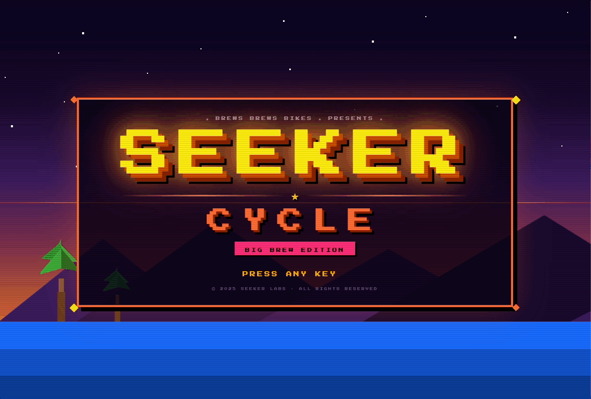

# Seeker Cycle
### Big Brew Edition

A multiplayer arcade racing game for real bike trainers. Up to eight riders connect their smart trainers, pedal hard, and race on a shared screen — power output drives everything. No simulated buttons, no controllers. Just legs.

---

## How It Works

Each player pairs their Bluetooth smart trainer to the game. Real-time power and cadence data feeds directly into the race — the harder you pedal, the faster you go. Results are saved to a local leaderboard after every session.

---

## Game Modes

### 🏁 Race
**First to finish wins.**

All riders start together and race to cover a set distance. Your speed is determined by your power output — higher watts means higher velocity. Riders are rendered in a third-person perspective view as they charge toward the sunset horizon. The finish line comes into view as the leader approaches, and the race ends when all riders cross or tap out.

Best finish times are tracked on the leaderboard.

---

### ⚡ Watts Battle
**Highest average watts wins.**

A flat-out power battle over a short, fixed time window (10–120 seconds, your choice). No distance to cover — just sustain the highest average output you can until the clock hits zero. WarioWare-style cartoon riders react to your effort in real time: they look bored at low power, focused mid-effort, and completely unhinged at max output.

Best average watts are tracked on the leaderboard.

---

### 🔒 Endurance *(coming soon)*
Hold a target power zone for as long as possible.

### 🔒 Sprint *(coming soon)*
Max-effort intervals — peak power over a very short window.

---

## Leaderboards

The main menu shows live leaderboards for each mode. Race records are ranked by best finish time. Watts Battle records are ranked by best average watts. Everything is stored locally — no accounts, no cloud.

---

## Credits

Made with ❤️ by **Brews Brews & Bikes**

---

*For setup instructions, hardware compatibility, and development notes, see [TECHNICAL.md](TECHNICAL.md).*
